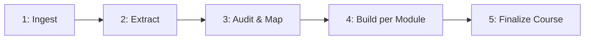

# Legacy Course Converter

This skill turns old course material (Google Sheets/Slides/Docs, PowerPoint, Word, PDF) into the same structure the AI Product Strategy course uses: a scrollable HTML deck per module, a briefing-memo speaker notes file, a reader-facing shareable notes file, course-level documents, and a forkable strategy-repo template.

It is designed to be **copied as a folder** into the agent skills directory of any new course repo:

- *Claude Code*: `.claude/skills/legacy-course-converter/`
- *Cursor*: `.cursor/skills/legacy-course-converter/`

Once copied, the agent reads `SKILL.md` and follows the five-step workflow below. The examples in this file use `.claude/skills/...` paths — substitute `.cursor/skills/...` if you're on Cursor.

---

## When to invoke

Trigger this skill when ANY of the following is true:

- The user has legacy course material (`.pptx`, `.docx`, `.xlsx`, `.csv`, `.pdf`, Google Drive exports, raw text) and wants to rebuild it in this course format.
- The user asks to "convert", "port", "modernize", "rebuild", "adapt", or "translate" an old course or training program.
- The user drops files into an `insights/`, `source/`, `legacy/`, or similarly named folder and asks for the new structure.
- The user references this course's structure (HTML slides + speaker notes + strategy repo) as the target format.

If the user is starting a course **from scratch with no legacy material**, use the `course-module-builder` skill instead.

---

## Target Output Structure

The end state of a converted course matches this exactly:

```
<New Course Name>/
├── index.html                          # Optional: redirect to pitch deck
├── course-architecture.md              # Full arc, principles, module summaries
├── storyline.md                        # Narrative arc and session rhythm
├── course-status.md                    # Module status tracker
├── content-audit.md                    # Legacy → new mapping (this skill produces it)
│
├── Modules/
│   ├── Module 1 - Slides.html          # Scrollable HTML deck
│   ├── Module 1 - Speaker Notes.md     # Instructor briefing memo
│   ├── Module 1 - Notes (Shareable).md # Reader-facing companion
│   ├── M1 - {Tool Name}.html           # Optional interactive tool(s)
│   └── ...                             # Repeat per module
│
├── insights/                           # Original legacy source files live here
│   ├── *.pptx / *.docx / *.xlsx / *.pdf
│   └── extracted/                      # Markdown extractions (this skill produces it)
│
├── strategy-repo-template/             # Forkable student template
│   ├── README.md                       # Living strategy dashboard
│   └── 01-{name}/ ... 06-{name}/
│
├── AGENTS.md                           # Persistent guidance (Claude Code) — slide + notes standards
└── .claude/                            # Or .cursor/ if you're on Cursor
    └── skills/
        └── legacy-course-converter/    # This skill, copied here
```

---

## Gold Standard References

Match these exactly. Do not invent a new format.

| Asset | Reference file | Why it's the standard |
|-------|----------------|----------------------|
| HTML slide deck | `Modules/Module 2 - Slides.html` | Best balance of density, visuals, exercises |
| Speaker notes | `Modules/Module 3 - Speaker Notes.md` | Briefing-memo tone Carlos uses |
| Shareable notes | `Modules/Module 1 - Notes (Shareable).md` | Reader-facing companion format |
| Interactive tool | `Modules/M2 - Flywheel Scorer.html` | Scorecard pattern with localStorage |
| Course architecture | `course-architecture.md` (in this repo) | Full arc + principles + audience |
| Strategy repo template | `strategy-repo-template/README.md` | Living dashboard format |

When the user is converting a different course, the new course will have its own gold-standard module by Module 2 — until then, **copy the structure from the references above**.

---

## The Five-Step Workflow



### Step 1 — Ingest legacy material

The user drops legacy files into `insights/` (create the folder if missing). Confirm what's there before going further.

```bash
ls -la insights/
```

For each file, identify the format and the role:

| Format | Common role |
|--------|-------------|
| `.pptx` / `.key` | Original slide deck — main source of slide content |
| `.docx` / `.gdoc` | Course outline, learning objectives, instructor script |
| `.xlsx` / `.gsheet` / `.csv` | Module sequencing, learning objectives matrix, exercise list |
| `.pdf` | Locked exports of any of the above; sometimes whole textbooks |
| `.txt` / `.md` | Speaker transcripts, raw notes |

If files arrived as Google Drive links, ask the user to download them as the closest local format (`.pptx` for Slides, `.docx` for Docs, `.xlsx` for Sheets) and place them in `insights/`.

See [ingestion-guide.md](ingestion-guide.md) for per-format details.

### Step 2 — Extract to markdown

Run the appropriate extraction script per file format. All scripts emit one or more markdown files into `insights/extracted/`.

```bash
pip install -r .claude/skills/legacy-course-converter/scripts/requirements.txt

# Run from the course repo root:
python .claude/skills/legacy-course-converter/scripts/extract_pptx.py insights/old-deck.pptx
python .claude/skills/legacy-course-converter/scripts/extract_docx.py insights/outline.docx
python .claude/skills/legacy-course-converter/scripts/extract_xlsx.py insights/syllabus.xlsx
python .claude/skills/legacy-course-converter/scripts/extract_pdf.py  insights/book-export.pdf
```

Each script is non-destructive, idempotent, and writes to `insights/extracted/{source-filename}.md`. After this step, you have a fully readable markdown corpus of the legacy course.

### Step 3 — Audit and map

Open [content-audit-template.md](content-audit-template.md), copy it to the **course repo root** as `content-audit.md`, and fill it in by reading every file in `insights/extracted/`.

The audit produces three tables:

1. **Module arc** — what the new modules will be (titles, strategic questions, sequence).
2. **Legacy-to-new mapping** — every legacy slide / row / section assigned to a target module + slide.
3. **Gaps and adds** — where the legacy material is missing something the new format requires (interactions, build moments, real company examples), and what to add.

This step is **mandatory** and **manual** (agent fills it in, user reviews). Do not skip it. The audit is what prevents the agent from blindly converting a 60-row Google Sheet into a 60-slide deck.

### Step 4 — Build each module

For each module in the audit, in order:

1. Create `Modules/Module {N} - Slides.html` using the structure in [slide-template.md](slide-template.md). Match Module 2 of the AI Product Strategy course for density, visuals, tags, and interaction frequency.
2. Create `Modules/Module {N} - Speaker Notes.md` using the structure in [speaker-notes-template.md](speaker-notes-template.md). Match Module 3 for tone (briefing memo for the named instructor).
3. Create `Modules/Module {N} - Notes (Shareable).md` using the structure in [shareable-notes-template.md](shareable-notes-template.md). Match Module 1's shareable notes for tone (reader-facing walkthrough, no instructor voice).
4. **Optional**: if a slide describes an exercise that would benefit from a live tool (scorecard, calculator, audit, builder, checklist, positioning map), create `Modules/M{N} - {Tool Name}.html` using patterns in [interactive-tools-reference.md](interactive-tools-reference.md). Skip this if the legacy material has no exercise structure to support it.
5. Update the audit's **Module arc** table — mark this module as `Built`.

After each module is built, ask the user to review before moving on. Do **not** batch-build all modules without checkpoints — the first module sets the design choices for every other module.

### Step 5 — Finalize the course

Once all modules are built:

1. Create the four course-level documents using stubs in [course-scaffold-templates.md](course-scaffold-templates.md):
   - `course-architecture.md`
   - `storyline.md`
   - `course-status.md`
   - `index.html` (optional)
2. Scaffold `strategy-repo-template/` with one folder per module: `01-{name}/` through `0N-{name}/`. Drop a `README.md` at the root that mirrors the format in [course-scaffold-templates.md](course-scaffold-templates.md).
3. Add agent guidance to the new repo so the slide + speaker-notes standards persist on every edit:
   - *Claude Code*: write the contents from [cursor-rules-templates.md](cursor-rules-templates.md) into `AGENTS.md` at the repo root.
   - *Cursor*: copy the two `.mdc` files into `.cursor/rules/`.
   Replace instructor name, reference modules, and tool names with the new course's specifics.
4. Update `course-status.md` to `Draft complete` for all modules.

---

## Design System (Locked)

Do not invent new colors, fonts, or layouts. Copy these tokens verbatim into every slide deck.

| Token | Value | Usage |
|-------|-------|-------|
| Background | `#07162C` | Body / slide background |
| Surface | `#0c2340` | Cards, panels |
| Accent | `#1241B0` | Module tag, progress bar, active elements |
| Heading | `#fff` | h1, h2, strong |
| Body text | `#b0b4c8` | Paragraphs, list items |
| Subtle text | `#8899bb` | Subtitles, descriptions |
| Emphasis | `#60a5fa` | `<em>` tags (blue, not italic) |
| Heading font | `Poppins` | h1, h2 |
| Body font | `Lato` | Everything else |
| Mono font | `IBM Plex Mono` / `JetBrains Mono` | Code, fill-in blanks |

Full CSS lives in [slide-template.md](slide-template.md). For interactive tools, the tool design tokens are slightly darker — see [interactive-tools-reference.md](interactive-tools-reference.md).

---

## Naming Conventions (Strict)

| Asset | Pattern | Example |
|-------|---------|---------|
| Slide deck | `Module {N} - Slides.html` | `Module 3 - Slides.html` |
| Speaker notes | `Module {N} - Speaker Notes.md` | `Module 3 - Speaker Notes.md` |
| Shareable notes | `Module {N} - Notes (Shareable).md` | `Module 3 - Notes (Shareable).md` |
| Interactive tool | `M{N} - {Tool Name}.html` | `M2 - Flywheel Scorer.html` |
| Strategy folders | `{NN}-the-{name}/` | `03-the-margin/` |

`N` is the integer module number. Do not zero-pad in module file names. Strategy repo folders DO zero-pad.

---

## Things This Skill Does NOT Do (Out of Scope)

- It does not generate the 4-5 MB self-contained `Slides (Shareable).html` exports. Those appear to be one-off rendered exports of the slide HTML — produce manually if needed (Save As Web Archive, or screenshot-export pipeline).
- It does not run a Gamma pitch deck flow. Use the `course-module-builder` skill's "Pitch Deck via Gamma" workflow when you need a high-level overview deck for stakeholders.
- It does not invent course content. Every slide and speaker note must trace back to either a legacy artifact (cited in the audit) or an explicit user instruction.
- It does not modify legacy source files in `insights/`. They are read-only inputs.

---

## Quick Start (TL;DR for Dana)

1. Make a new repo for the course.
2. Copy `legacy-course-converter/` into `.claude/skills/` (Claude Code) or `.cursor/skills/` (Cursor).
3. Drop your legacy files (Google Sheet, PowerPoint, Word, PDF) into `insights/`.
4. Open Cursor and tell the agent: *"Use the legacy-course-converter skill to convert the files in insights/ into the new course structure."*
5. Review the content audit when the agent shows it. Adjust the module arc until it matches what you want.
6. Tell the agent to build Module 1. Review. Then Module 2. And so on.
7. Tell the agent to finalize the course (course-architecture.md, strategy-repo-template, cursor rules).
